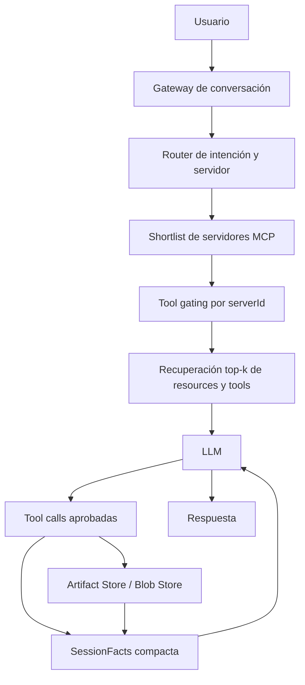
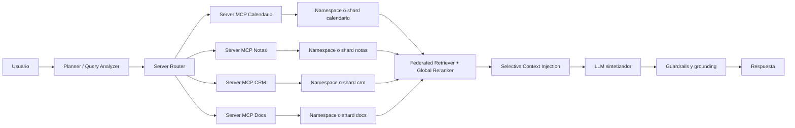
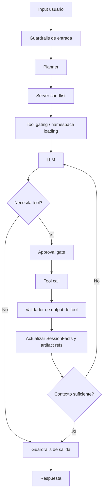

# Memoria y respuesta precisa para Neo con múltiples servidores MCP

## Resumen ejecutivo

El problema central de una app *Emotional AI* conectada a muchos servidores MCP no es solo “tener más memoria”, sino controlar tres superficies a la vez: el estado conversacional activo, la memoria longitudinal del usuario y, sobre todo, la superficie de herramientas y resultados intermedios que entra al contexto del modelo. El propio protocolo MCP está diseñado como una arquitectura host-cliente-servidor donde el host agrega contexto, y cada cliente mantiene una sesión 1:1 con un servidor; por eso, la memoria operativa de Neo debe modelarse también por servidor, no como un bloque monolítico. citeturn17view0turn17view1turn17view2

La evidencia más fuerte apunta a que, cuando el número de tools y resultados crece, las alucinaciones y los errores de selección empeoran. entity["organization","Anthropic","ai company"] documenta despliegues MCP con cientos o miles de tools y observa que las definiciones de herramientas y los resultados intermedios pueden consumir decenas de miles de tokens antes de que el agente procese la consulta. Benchmarks recientes como ToolBH, ToolHaystack y SimpleToolHalluBench muestran que los modelos siguen fallando al decidir si una tarea es resoluble, al ignorar que falta una tool necesaria o al dejarse arrastrar por tools distractoras en contextos largos. El paper RAG-MCP es especialmente relevante para tu caso porque propone recuperar solo descripciones de tools relevantes en vez de exponerlas todas, reportando una caída importante del tamaño del prompt y una mejora marcada en recuperación de herramientas frente al baseline. citeturn34search12turn35search1turn35search0turn25search2turn0academia20

Mi recomendación para Neo es una arquitectura de memoria por capas. La base debe ser una **working memory** compacta de sesión, persistida por hilo y por `serverId`. Encima, una **long-term memory** separada para preferencias, hechos, episodios y límites del usuario. En paralelo, un **broker de recuperación** federado que consulte índices o namespaces por servidor y fusione resultados con *reranking*. Y antes de que cualquier tool llegue al modelo, un **tool gating** en dos etapas: primero escoger servidores; después, dentro de cada servidor, anunciar solo el subconjunto de tools elegibles para esa consulta. Esta combinación está alineada con MCP, con los patrones de memoria/persistencia de LangGraph, con las capacidades de tool filtering y deferred loading del Agents SDK, y con los patrones de router retrievers y query decomposition de LlamaIndex. citeturn17view0turn18view1turn18view3turn15view1turn33view2turn32view1turn32view2

Para una app emocional, además, no conviene mezclar en la misma bolsa “afecto actual”, “preferencias estables”, “hechos sobre el usuario”, “IDs de herramientas” y “payloads grandes”. Los trabajos de Letta, Mem0, MemoryBank y CarMem convergen en la misma dirección: la memoria útil es selectiva, estructurada, actualizable y explícita; la memoria indiscriminada se contradice, se vuelve obsoleta y hace al sistema más caro y menos fiable. CarMem es especialmente interesante porque usa categorías acotadas para memoria de asistentes y reporta reducciones fuertes de preferencias redundantes o contradictorias, algo muy aplicable a una capa emocional con consentimiento y trazabilidad. citeturn30view0turn29view0turn27search11turn37search1turn36search0

## Diagnóstico del problema

MCP define una separación clara entre host, clientes y servidores. El host coordina múltiples clientes, cada cliente mantiene una sesión aislada con un servidor, y los servidores exponen *resources*, *tools* y *prompts* con negociación explícita de capacidades. Esa separación es una pista arquitectónica muy útil: si el estado de Neo no está particionado por servidor, acabarás mezclando handles, IDs, artefactos y resúmenes de fuentes distintas en un mismo prompt, lo que aumenta ambigüedad y errores de reutilización. citeturn17view0turn17view1turn17view2

El segundo problema es el exceso de surface area. En MCP, las tools son *model-controlled* y se descubren con `tools/list`; los resources son *application-driven* y el host decide cómo incorporarlos al contexto. En otras palabras: el protocolo no obliga a inyectar todo al modelo. Si Neo enumera todas las tools conectadas y además pasa resultados enteros de cada llamada al LLM, la app está usando MCP de la manera más costosa y menos precisa posible. citeturn17view1turn17view2turn15view2

El tercer problema es la degradación por longitud y distractores. LangChain/LangGraph recuerda explícitamente que las conversaciones largas no solo cuestan más y se acercan al límite del contexto: también distraen al modelo con contenido viejo o fuera de tema. OpenAI, por su parte, ya ofrece compaction para conversaciones largas, y Anthropic describe el mismo fenómeno desde el ángulo MCP: tools y resultados intermedios inflan el contexto, ralentizan la ejecución y empeoran la eficiencia. citeturn18view0turn18view2turn21view2turn34search12

| Riesgo en Neo | Qué lo produce | Síntoma típico | Control recomendado |
|---|---|---|---|
| Sobrecarga de tools | Muchos servidores MCP y catálogos completos expuestos al modelo. citeturn34search12turn15view1turn33view2 | Calls incorrectas, bloqueo del plan, o tool irrelevante elegida primero. citeturn35search1turn25search4 | *Server routing* + *tool gating* + namespaces/deferred loading. citeturn15view1turn33view1turn22search0 |
| Contexto inflado por outputs | Resultados grandes devueltos al modelo turno tras turno. citeturn34search12turn21view2 | Mayor latencia, más costo y pérdida de foco. citeturn21view2turn18view2 | Guardar artefactos fuera del prompt y pasar solo resúmenes + referencias estables. Esta es una inferencia operativa consistente con compaction y con el patrón de “procesar fuera del contexto”. citeturn21view2turn34search12 |
| Mezcla de memorias heterogéneas | Un mismo almacén para perfil, tools, episodios y afecto. citeturn30view0turn36search0turn37search1 | Contradicciones, recuerdos obsoletos y respuestas “demasiado personales” o incoherentes. citeturn36search0turn37search1turn35search1 | Separar working memory, long-term user memory y tool state. citeturn18view0turn18view3turn30view0 |
| Datos distribuidos por silos | Servidores / índices / tenants aislados. citeturn32view0turn31view0turn31view1 | Baja cobertura o consultas demasiado globales y ruidosas. citeturn32view0turn20view2 | *Federated retrieval* con shards/namespaces y fusión global. citeturn32view0turn31view0turn31view1turn32view3 |
| Falta de control y trazabilidad | Sin validadores, aprobaciones ni trazas. citeturn26view0turn26view1turn7search9 | Errores difíciles de reproducir, fugas de PII o tool calls peligrosas. citeturn26view2turn17view1turn16search3 | Guardrails pre/post/tool + tracing + evaluaciones online/offline. citeturn26view2turn26view1turn28view3turn7search9 |

## Técnicas que aportan más valor

La mejor forma de leer el espacio de soluciones es distinguir entre técnicas de **memoria**, de **recuperación**, de **gestión de tools**, de **seguridad** y de **coste/latencia**. La tabla siguiente resume las que, a día de hoy, son más útiles para Neo.

| Técnica | Descripción técnica | Ventajas | Desventajas | Requisitos de integración | Proyectos / implementaciones |
|---|---|---|---|---|---|
| **Working memory con checkpoints** | Persistir el estado de cada hilo y de cada paso del agente, incluyendo mensajes, tool calls y snapshots de ejecución. LangGraph lo hace con *threads* y *checkpoints*; el Agents SDK soporta sesiones, estado y trazas. citeturn18view1turn18view2turn7search4turn7search9 | Excelente para continuidad inmediata, reintentos, human-in-the-loop y *fault tolerance*. citeturn18view1turn18view2 | No resuelve por sí sola la memoria transversal entre sesiones ni la explosión del contexto. citeturn18view0turn21view3 | `thread_id`, persistencia por paso, serialización de estado, política de poda. | LangGraph / LangChain; OpenAI Agents SDK. citeturn18view1turn18view3turn7search4turn7search9 |
| **Long-term memory semántica y episódica** | Extraer hechos, preferencias, episodios y reglas desde la conversación y almacenarlos como documentos JSON o bloques estructurados por *namespace* o categoría. LangGraph usa stores JSON; Letta usa *memory blocks* siempre visibles; Mem0 automatiza extracción, consolidación y recuperación; MemoryBank y CarMem son patrones de investigación relevantes para asistentes y compañía/emoción. citeturn18view3turn30view0turn27search11turn37search1turn36search0 | Mejora continuidad real y personalización entre sesiones. CarMem reporta menos redundancia/contradicción; Mem0 reporta mejoras fuertes en benchmarks de memoria. citeturn36search0turn27search11turn29view1 | Riesgo de *staleness*, sobre-memorización y problemas de privacidad si no hay consentimiento, TTL o deduplicación. citeturn36search0turn37search1 | Esquema por categorías, dedupe, versionado, TTL, consentimiento y separaciones claras entre memoria estable y afecto transitorio. | Mem0 OSS / paper / benchmarks; Letta / MemGPT; MemoryBank; CarMem. citeturn29view0turn27search5turn27search11turn29view2turn30view0turn10search0turn37search1turn36search0 |
| **Hybrid RAG + reranking** | Combinar recuperación densa y léxica, luego rerankear candidatos. Pinecone documenta dense+sparse+metadata+rereanking; Haystack y LlamaIndex ofrecen fusión y *reciprocal rerank fusion*. citeturn31view2turn23search7turn32view3 | Suele elevar recall y precisión frente a semántica sola. Muy útil cuando herramientas y resources tienen nombres específicos, IDs o vocabulario de dominio. citeturn31view2turn23search5turn32view3 | Añade complejidad y un paso extra de latencia. | Embeddings, sparse/keyword index, metadatos limpios, reranker o RRF. | Haystack, LlamaIndex, Pinecone. citeturn23search5turn32view3turn31view2 |
| **Hierarchical retrieval y auto-merging** | Particionar documentos en jerarquías padre-hijo y, cuando múltiples chunks hijos coinciden, devolver el padre o fusionar contexto. LlamaIndex y Haystack tienen AutoMergingRetriever; GraphRAG va más allá con grafo de conocimiento y resúmenes por comunidades. citeturn19search2turn23search1turn20view0 | Reduce el problema de “trozos desconectados” y mejora síntesis compleja. citeturn19search2turn20view2 | Indexado más costoso; en GraphRAG, costos especialmente altos y el propio repo advierte que el código es metodología/demo y que indexar puede ser caro. citeturn20view1turn20view2 | Chunking jerárquico, referencias padre-hijo, modo de consulta local/global, pipeline de indexado. | AutoMergingRetriever; GraphRAG. citeturn19search2turn23search1turn20view1turn20view0 |
| **Federated retrieval** | En vez de centralizar todos los datos, cada silo/servidor recupera su top-k y un broker central fusiona y reranquea. Flower lo muestra explícitamente para FedRAG. citeturn32view0 | Muy adecuado cuando cada servidor MCP representa una fuente distinta o con restricciones de acceso. Disminuye mezcla de ruido entre dominios. citeturn32view0turn17view0 | La calidad depende del *router* y de la estrategia de fusión global. | Índice por servidor, top-k por servidor, *merger* global, scores comparables y rastreo de procedencia. | FedRAG; Router Retriever y SubQuestionQueryEngine de LlamaIndex. citeturn32view0turn32view1turn32view2 |
| **Sharding y namespaces** | Particionar físicamente o lógicamente el almacenamiento por servidor, tenant o dominio. Qdrant soporta shards y *user-defined sharding*; Pinecone usa namespaces para aislamiento multitenant y consultas más rápidas. citeturn31view0turn31view1turn31view2 | Escala y aísla datos. Muy útil para mapear `serverId -> namespace/shard`. citeturn31view0turn31view2 | Más componentes operativos y potenciales errores de *routing*. | Esquema de particionado, metadatos estándar, política de rebalanceo y naming estable. | Qdrant, Pinecone. citeturn31view0turn31view1turn31view2 |
| **Selective context injection** | Inyectar al modelo solo el contexto relevante para la consulta actual: últimos hechos útiles, herramientas elegibles y documentos top-k. MCP ya deja recursos como *application-driven*; OpenAI ofrece compaction; Self-RAG propone recuperar solo cuando conviene; Anthropic insiste en cargar tools bajo demanda. citeturn17view2turn21view2turn9search2turn34search12 | Reduce *context rot*, costo y distracción. | Si el selector falla, puede ocultar contexto necesario. | Router ligero, score de relevancia y ruta de fallback cuando la confianza es baja. | Self-RAG; compaction; patrones MCP *application-driven*. citeturn9search2turn21view2turn17view2 |
| **Tool gating, namespaces y deferred loading** | Filtrar qué tools ve el modelo por servidor y por turno. MCP en OpenAI Agents SDK soporta filtros estáticos y dinámicos; el SDK también permite `ToolSearchTool`, `tool_namespace()`, tools diferidas y *conditional enabling*; Semantic Kernel deja controlar qué funciones se anuncian y si su elección es Auto/Required/None, con filtros include/exclude. citeturn15view1turn15view2turn33view0turn33view1turn33view2turn22search0turn22search3 | Es la técnica más directamente alineada con tu dolor de “demasiadas tools”. | Algunas capacidades son proveedor-específicas; si abusas de filtros rígidos, puedes bloquear tool uso útil. | Registro de tools con embeddings/metadata, shortlist por servidor, allowlists, políticas dinámicas y fallback. | OpenAI Agents SDK MCP + tool search; Semantic Kernel; RAG-MCP como patrón experimental. citeturn15view1turn33view2turn22search0turn0academia20 |
| **Guardrails y aprobaciones** | Validar inputs, outputs y tool calls, y pedir aprobación humana o programática para operaciones sensibles. El MCP spec recomienda humano en el loop para tools; OpenAI Agents SDK y HostedMCPTool soportan aprobaciones; NeMo Guardrails, Guardrails AI y LangChain ofrecen validadores/middleware. citeturn17view1turn16search3turn26view0turn26view1turn26view2 | Reduce fugas de PII, errores destructivos y tool misuse. | Más latencia y mayor complejidad de reglas. | Políticas antes/después del modelo y alrededor de tools, + canal de aprobación. | NeMo Guardrails, Guardrails AI, LangChain guardrails, approval flows del Agents SDK. citeturn26view0turn26view1turn26view2turn33view3 |
| **Caching y compaction** | Hay tres caches distintos: lista de tools MCP, prompt prefix cache y cache semántica de respuestas. OpenAI documenta *Prompt Caching* y *Compaction*; RedisVL implementa `SemanticCache`; el Agents SDK soporta `cache_tools_list` e invalidación; MCP tiene `listChanged` para cambios en catálogos. citeturn21view1turn21view2turn21view0turn15view3turn17view1turn17view2 | Baja costo y latencia de forma inmediata. | El gran riesgo es la obsolescencia y la mala invalidación. | Claves estables, TTL, invalidación por `listChanged`, métricas de hit/miss, y orden estable del prompt para maximizar cache prefix. | OpenAI Prompt Caching / Compaction; RedisVL; cache de tools MCP. citeturn21view1turn21view2turn21view0turn15view3 |
| **Observabilidad y evaluación** | Medir el sistema en dos planos: offline con datasets y online con trazas reales. LangSmith distingue evaluación offline/online; Ragas ofrece métricas de RAG y agentes; DeepEval ofrece métricas de hallucination; el Agents SDK expone *usage* y *tracing*. citeturn28view3turn28view1turn28view2turn7search6turn7search9 | Es lo que evita que el sistema “parezca mejor” sin realmente mejorar. | Requiere datasets, etiquetado y observabilidad disciplinada. | `trace_id`, datasets de regresión, jueces, métricas por paso, dashboards. | LangSmith, Ragas, DeepEval, trazas del Agents SDK, benchmarks de memoria y tools. citeturn28view3turn28view1turn28view2turn7search9turn29view2turn36search12turn35search1turn35search0 |

Dos patrones experimentales merecen seguimiento cercano. El primero es **RAG-MCP**, porque ataca exactamente el problema de catálogos grandes de tools mediante recuperación sobre descripciones de herramientas en vez de exposición total. El segundo es **code execution with MCP**, que Anthropic recomienda cuando el catálogo y los datos intermedios ya no caben bien en el contexto: el agente carga solo las tools necesarias, procesa datos fuera de la ventana del modelo y devuelve solo lo imprescindible. Ambos son muy prometedores para Neo, aunque el primero sigue más cerca de la línea de investigación que de un estándar de plataforma consolidado. citeturn0academia20turn34search12

## Frameworks, proyectos y herramientas relevantes

La selección adecuada depende de si priorizas neutralidad de proveedor, velocidad de implementación, control fino del estado o eficiencia con catálogos grandes de tools. Para Neo, la mejor estrategia no es elegir una sola pieza, sino combinar un **runtime de estado**, un **stack MCP**, un **broker de retrieval**, una **capa de memoria** y una **capa de guardrails**.

| Solución | Madurez | Encaje para Neo | Riesgo principal | Repositorio / paper / docs |
|---|---|---|---|---|
| **LangGraph / entity["organization","LangChain","ai framework company"]** | Producción OSS | Muy bueno como núcleo de estado: *threads*, checkpoints, stores JSON, memoria corta y larga, HITL y recuperación de fallos. citeturn18view1turn18view3turn18view4 | No resuelve por sí mismo el problema del *tool overload*; necesita router y gating por encima. | Docs oficiales. citeturn18view1turn18view3turn18view4 |
| **entity["organization","OpenAI","ai company"] Agents SDK** | Producción, pero proveedor-específico para algunas funciones | Excelente si usarás modelos Responses y quieres tool search, deferred loading, HostedMCPTool, tool filters, sesiones, usage y tracing en un solo stack. citeturn14view0turn15view1turn33view1turn7search6turn7search9 | Algunas características críticas para catálogos grandes dependen del backend Responses. | Docs oficiales. citeturn14view0turn33view2turn21view2 |
| **entity["organization","LlamaIndex","ai framework company"]** | Producción OSS | Muy fuerte para recuperación avanzada: router retriever, sub-question query engine, auto-merging y fusión. Es de las mejores piezas para un broker federado multi-MCP. citeturn32view1turn32view2turn19search2turn32view3 | Si se usa como “framework total”, puede introducir complejidad innecesaria; brilla más como capa de retrieval. | Docs oficiales y ejemplos. citeturn32view1turn32view2turn19search2turn32view3 |
| **Semantic Kernel / entity["organization","Microsoft","software company"]** | Producción enterprise | Muy útil cuando quieres gobernar qué funciones se anuncian, cómo se eligen y aplicar filtros empresariales a plugins/funciones. citeturn22search0turn22search3turn22search15 | Menos centrado que OpenAI Agents SDK en MCP/tool search on-demand; encaja mejor en ecosistemas .NET/Azure. | Docs oficiales. citeturn22search0turn22search3turn22search15 |
| **entity["organization","Mem0","ai memory company"]** | Producción emergente | Muy buen candidato para memoria longitudinal si priorizas extracción/consolidación automática y quieres OSS + benchmarks abiertos. citeturn29view0turn27search11turn29view2 | Parte de la evidencia de rendimiento viene del propio proveedor, aunque paper y suite de benchmarks son públicos. | Docs, OSS, paper y benchmarks. citeturn29view0turn27search5turn27search11turn29view2 |
| **entity["organization","Letta","ai memory company"]** | Avanzado / creciente | Muy interesante si quieres agentes realmente *stateful* con memoria estructurada visible siempre, subagentes y mejora continua. Las *memory blocks* son una idea valiosa para persona/perfil. citeturn30view0turn30view1turn30view2 | Precisamente porque esos bloques están siempre en contexto, no conviene usarlo para payloads ruidosos ni para logs de tools. | Docs y repo oficiales. citeturn30view0turn30view1turn30view2 |
| **GraphRAG de Microsoft** | Avanzado / experimental productivo | Muy potente para corpora complejos donde necesitas visión global, relaciones y síntesis de grandes colecciones. citeturn20view0turn20view2 | El repo avisa que la metodología es demostrativa y el indexado puede ser caro; no lo usaría como default para cada servidor MCP. citeturn20view1 | Docs, repo y paper. citeturn20view0turn20view1turn20view2 |
| **FastMCP / entity["organization","Prefect","workflow company"]** y **mcp-agent** | Producción OSS / avanzado | Muy buen stack MCP. FastMCP simplifica servidores/clientes; mcp-agent añade patrones para router, orchestrator, map-reduce, evaluator-optimizer y ejecución durable con Temporal. citeturn14view4turn14view3 | Son infraestructura, no solución completa de memoria. | Repos y docs oficiales. citeturn14view4turn14view3 |
| **NeMo Guardrails / entity["organization","NVIDIA","gpu company"]**, **entity["organization","Guardrails AI","validator framework company"]** y guardrails de LangChain | Producción | Muy útiles para filtrado, validación de output, grounding, PII, políticas y flujos de aprobación. citeturn26view0turn26view1turn26view2 | Si se abusa de guardrails model-based, la latencia puede dispararse. | Docs oficiales. citeturn26view0turn26view1turn26view2 |
| **RedisVL / entity["organization","Redis","database company"]**, **entity["organization","Qdrant","vector database company"]** y **entity["company","Pinecone","vector database company"]** | Producción infraestructura | Combinación muy práctica: semantic cache, shards/namespace y retrieval escalable por servidor o tenant. citeturn21view0turn31view0turn31view1turn31view2 | Son piezas infra; necesitan un broker de routing y políticas de invalidez/dedupe. | Docs oficiales. citeturn21view0turn31view0turn31view1turn31view2 |

Entre los papers y proyectos de investigación que más sí conviene conocer para entender el diseño de Neo están ReAct, Toolformer, Self-RAG, MemGPT, MemoryBank, Mem0, ToolBH, ToolHaystack y FedRAG. ReAct y Toolformer explican la lógica de “pensar y actuar” y de aprender a usar herramientas; Self-RAG aporta recuperación adaptativa y autocrítica; MemGPT/Letta, MemoryBank y Mem0 empujan el diseño de memoria externa y persistente; ToolBH y ToolHaystack te sirven para no autoengañarte con benchmarks demasiado fáciles; y FedRAG da una base útil para retrieval sobre silos distribuidos. citeturn9search0turn9search1turn9search2turn10search0turn37search1turn27search11turn35search1turn35search0turn32view0

## Arquitectura recomendada para Neo

### Principios de diseño

Mi recomendación práctica es que Neo trate `SessionFacts` como **hot state compacta**, no como sistema de registro completo. El registro completo de payloads grandes debe vivir fuera: store de artefactos, vector DB, blob storage o la propia fuente MCP si el handle sigue siendo válido. En el prompt solo deberían entrar resúmenes, IDs estables, *cursors*, URIs y muy pocos hechos del usuario con alta relevancia para la consulta actual. Esto sigue la dirección marcada por compaction, selective resources en MCP y carga de tools bajo demanda. citeturn21view2turn17view2turn34search12

También recomiendo una topología de decisión en **dos niveles**. Primero: ¿qué servidores son plausiblemente relevantes para esta consulta? Segundo: dentro de cada servidor, ¿qué tools o resources concretos merecen ser visibles? Este patrón está respaldado por MCP tool filters, por el *function advertising* de Semantic Kernel, por ToolSearchTool/deferred loading en el Agents SDK y por router retrievers en LlamaIndex. citeturn15view1turn15view2turn22search0turn33view2turn32view1

Finalmente, para Emotional AI, separaría la memoria del usuario en cinco dominios: **perfil estable**, **preferencias explícitas**, **episodios relevantes**, **estado afectivo reciente** y **límites/consentimiento**. La razón es simple: Letta muestra el valor de bloques explícitos para memoria visible; CarMem demuestra que acotar memoria por categorías reduce redundancias y contradicciones; y MemoryBank muestra que la memoria longitudinal mejora la continuidad en interacciones tipo compañía o acompañamiento. citeturn30view0turn36search0turn37search1

### Estructura recomendada de `SessionFacts`

La forma más robusta de estructurar `SessionFacts` en Neo es reflejar la arquitectura MCP: una raíz pequeña de conversación, un cajón por `serverId` y referencias a artefactos externos. La propuesta siguiente está pensada para reutilización de resultados, deduplicación y poda agresiva. Está alineada con el modelo de *thread state* y *long-term store* de LangGraph, con el hecho de que MCP opera por servidor, y con la necesidad de compaction/caching. citeturn17view0turn18view1turn18view3turn21view2

```json
{
  "v": 2,
  "threadId": "t_123",
  "userId": "u_456",
  "conversation": {
    "goal": "resolver consulta actual",
    "summary": "resumen compacto del hilo",
    "pendingSlots": ["fecha", "serverId"],
    "emotionalState": {
      "current": "ansioso",
      "confidence": 0.72,
      "ttlSec": 1800
    },
    "compaction": {
      "lastCompactedAt": "2026-04-25T10:20:00Z",
      "artifactRefs": ["blob://turn/44"]
    }
  },
  "mcp": {
    "calendar": {
      "capabilities": {
        "tools": true,
        "resources": true,
        "prompts": false,
        "listChanged": true
      },
      "catalog": {
        "toolHash": "sha256:...",
        "listedAt": "2026-04-25T10:21:00Z",
        "cacheTtlSec": 900
      },
      "toolsLatest": {
        "find_events": {
          "ok": true,
          "updatedAt": "2026-04-25T10:21:05Z",
          "stableRefs": ["evt_123", "evt_124"],
          "summary": "2 eventos para la próxima semana",
          "artifactRef": "blob://calendar/find_events/abc",
          "freshnessSec": 300
        }
      },
      "lastTurn": [
        {
          "tool": "find_events",
          "status": "ok",
          "argsHash": "sha256:...",
          "summary": "2 eventos encontrados",
          "stableRefs": ["evt_123", "evt_124"],
          "latencyMs": 420
        }
      ]
    }
  }
}
```

La regla más importante es esta: **`toolsLatest` debe almacenar solo el último resultado bueno reutilizable por nombre de tool**, no la respuesta completa. Ahí deberían vivir IDs, *stable refs*, ventanas temporales, hashes, resumidos compactos y un `artifactRef` externo. Y **`lastTurn` solo debe representar el turno actual o, como mucho, un buffer mínimo del último tramo**, nunca crecer sin control. Esa recomendación se apoya en la advertencia de LangChain sobre conversaciones largas, en la compaction de OpenAI y en el análisis de Anthropic sobre resultados intermedios dentro del contexto. citeturn18view0turn18view2turn21view2turn34search12

### Políticas de truncado y priorización

La política de truncado no debería ser solo “cortar por tamaño”, sino “cortar por utilidad marginal”. En Neo conviene puntuar cada ítem al persistirlo y al decidir si entra o no al prompt. Una política razonable es priorizar: **seguridad y consentimiento**, **goal y slots activos**, **IDs/refs reutilizables**, **memoria afectiva reciente con TTL corto**, **perfil/preferencias estables**, y solo después **resúmenes de outputs voluminosos**. Esto es coherente con el concepto de *context engineering* y con la carga on-demand de herramientas. citeturn34search8turn33view2turn17view2

Para que sea operativo, usaría reglas simples y duras:

- Si un output supera ~2.000 tokens o es una lista larga, persistir solo `summary + stableRefs + artifactRef`.
- Si una tool devuelve un identificador importante, ese ID se **pinea** aunque el resumen se recompacte.
- `lastTurn` por servidor: máximo 6 a 8 items o un tope de bytes/tokens.
- `toolsLatest`: máximo una entrada activa por tool más una previa de seguridad, si la tool produce IDs que cambian.
- Estado afectivo reciente: TTL corto; jamás se reutiliza como “verdad permanente” sin revalidación.
- Preferencias estables: solo entran al prompt si el *router* emocional o semántico marca relevancia.
- Si un servidor anuncia cambios de catálogo (`listChanged`), invalidar la caché de `list_tools()` y recalcular embeddings/metadata del catálogo. Esta recomendación es una inferencia directa del spec MCP y del soporte de invalidación en el Agents SDK. citeturn17view1turn17view2turn15view3

### Diagramas de arquitectura

La primera arquitectura es la **base mínima**. Debe ser barata, explicable y suficiente para empezar a medir. Se apoya en SessionFacts compacta, shortlist por servidor y retrieval híbrido sencillo. Está alineada con MCP, LangGraph/Agents SDK y semantic cache. citeturn17view0turn18view1turn21view0turn21view2



La segunda arquitectura es la que recomiendo para **escala multi-MCP**. Aquí cada servidor tiene su namespace o shard, y Neo consulta de forma federada para no centralizar ruido. Después fusiona, rerankea y solo entonces sintetiza. Esa forma de trabajo está respaldada por FedRAG, por Router/SubQuestion de LlamaIndex y por la infraestructura de shards/namespaces de Qdrant y Pinecone. citeturn32view0turn32view1turn32view2turn31view0turn31view1



La tercera arquitectura es la que aconsejo cuando Neo ya funcione como **agent loop** con herramientas sensibles. La clave aquí es que el modelo no vea todo el universo de tools de entrada; primero recibe un conjunto pequeño, validado y habilitado contextualmente. Después de cada tool call, hay guardrails, actualización de memoria y decisión explícita de continuar o responder. citeturn15view1turn33view0turn26view2turn33view3turn7search9



## Métricas y plan de evaluación

Neo no debería evaluarse con una única métrica tipo “me respondió bien”. Necesitas medir en cuatro planos: **routing**, **retrieval**, **generación** y **operación/coste**. LangSmith, Ragas y DeepEval ya separan bien estas capas; además, los benchmarks de memoria y tools recientes te permiten probar los fallos que realmente importan en una app multi-MCP. citeturn28view3turn28view1turn28view2turn29view2turn36search12turn35search1turn35search0

| Dimensión | Qué medir | Cómo medirlo | Herramientas / benchmarks |
|---|---|---|---|
| **Routing de servidores** | `server_recall@k`, `server_precision@k`, tasa de consultas mal roteadas | Dataset con preguntas etiquetadas por servidor correcto; evaluar el shortlist antes de cualquier tool call | Router propio + trazas; LangSmith offline. citeturn28view3turn7search9 |
| **Selección de tools** | `tool_call_accuracy`, tasa de falso positivo, tasa de abstención correcta cuando falta la tool | Casos con tools faltantes y distractoras | Ragas para agentes; ToolBH; SimpleToolHalluBench. citeturn28view1turn35search1turn25search2 |
| **Retrieval** | `context_precision`, `context_recall`, `noise_sensitivity`, relevancia de documentos | Comparar contexto recuperado con *golden context* o LLM judge de recuperación | Ragas; LangSmith RAG eval. citeturn28view1turn28view0 |
| **Generación** | Correctness, groundedness, faithfulness, hallucination rate, abstention | Comparar respuesta vs referencia y vs contexto recuperado | LangSmith, Ragas, DeepEval. citeturn28view0turn28view1turn28view2 |
| **Memoria longitudinal** | Recall factual, razonamiento temporal, multi-hop, knowledge update, contradicción, redundancia | Escenarios multi-sesión con ground truth por categoría | LongMemEval, LoCoMo, BEAM, benchmarks de Mem0. citeturn36search12turn29view2turn29view1 |
| **Robustez en interacciones largas** | Caída de rendimiento al crecer el historial y al meter ruido | Conversaciones largas con tareas mezcladas y distractores | ToolHaystack. citeturn35search0 |
| **Coste y latencia** | `p50/p95`, tokens de input/output, `cached_tokens`, hit rate de prompt cache, hit rate de semantic cache, hit rate de tools cache | Medición por traza y por paso | OpenAI usage/prompt caching; RedisVL; Agents SDK tracing. citeturn7search6turn21view1turn21view0turn15view3 |
| **Seguridad y cumplimiento** | PII leakage rate, tool denials, approval interrupt rate, grounding failures | Validadores automáticos + muestreo humano | Guardrails AI, NeMo Guardrails, LangChain guardrails. citeturn26view0turn26view1turn26view2 |

Para Neo, el plan de evaluación más sensato sería este. Primero, construir un set offline pequeño pero bien curado con consultas reales repartidas por servidor MCP, memoria de usuario y errores históricos. Segundo, añadir datasets sintéticos de estrés: tools faltantes, tools distractoras, contextos largos y actualizaciones de preferencias contradictorias. Tercero, activar evaluación online con muestreo, no para bloquear el sistema, sino para detectar degradación por release, por incorporación de nuevos servidores o por crecimiento del catálogo de tools. Ese circuito está alineado con la distinción offline/online de LangSmith y con el uso de trazas/usage del Agents SDK. citeturn28view3turn7search6turn7search9

## Recomendación práctica para Neo

Si tuviera que priorizar una hoja de ruta realista para Neo, la dividiría en tres niveles.

En la **base mínima**, implementaría una `SessionFacts` compacta por `threadId` con `mcp[serverId]`, `toolsLatest` y `lastTurn`, pero guardando payloads grandes fuera del prompt. Añadiría un router de servidor muy simple, una búsqueda híbrida por servidor, y un *tool gating* basado en allowlists y metadatos. Ya en esta fase activaría semantic cache, tool-list cache y compaction. Esto te da rápidamente mejoras de costo, latencia y precisión sin meterte aún en un stack excesivamente complejo. citeturn15view3turn21view0turn21view1turn21view2turn31view2

En la **fase escalable**, movería la recuperación a un patrón federado. Cada servidor MCP tendría su namespace o shard lógico; el broker recogería un top-k pequeño por fuente, fusionaría y rerankearía antes de sintetizar. En este punto ya tendría sentido introducir Router Retriever/SubQuestionQueryEngine y, solo para corpora complejos o preguntas globales, modos tipo GraphRAG. Para el perfil emocional del usuario, usaría categorías explícitas inspiradas en CarMem y bloques muy pequeños al estilo Letta para “persona del asistente”, “límites” y “preferencias estables”; nunca usaría bloques siempre visibles para logs de tools o documentos enteros. citeturn32view0turn32view1turn32view2turn20view0turn20view1turn36search0turn30view0

En una **fase avanzada**, si Neo termina teniendo docenas de servidores y cientos de tools, introduciría recuperación sobre catálogos de tools al estilo RAG-MCP o usaría runtimes que permitan tool search / deferred loading. Y si el flujo empieza a mover outputs intermedios demasiado grandes, consideraría una modalidad de ejecución de código con MCP para que el agente procese resultados fuera del contexto y devuelva al modelo solo conclusiones o *stable refs*. Ese paso tiene sentido cuando el cuello de botella ya no es el razonamiento del modelo, sino la superficie operativa de tools y artefactos. citeturn0academia20turn33view2turn34search12

La decisión de stack que veo más sólida para Neo sería esta: **LangGraph** o un runtime equivalente como columna vertebral del estado; **MCP con FastMCP/mcp-agent o Agents SDK** como capa de herramientas; **LlamaIndex** o un broker propio para retrieval federado y routing; **Mem0** o una capa long-term memory propia si quieres control total; **RedisVL** para semantic cache; **Qdrant o Pinecone** para namespaces/shards; y **guardrails** antes y después del modelo y de cada tool crítica. Esa combinación separa responsabilidades y evita el error común de pedirle al prompt que haga el trabajo que debería hacer la arquitectura. citeturn18view1turn14view3turn14view4turn32view1turn29view0turn21view0turn31view0turn31view1turn26view2

## Preguntas abiertas y limitaciones

Hay cuatro límites importantes que conviene tener presentes.

Primero, varias funciones muy potentes para tool loading bajo demanda hoy son dependientes del proveedor o del backend concreto; no todos los runtimes MCP ofrecen el mismo nivel de *tool search*, aprobaciones o compaction. citeturn33view2turn21view2

Segundo, GraphRAG es valioso, pero no debería convertirse en martillo universal. La propia documentación y el repo advierten sobre el coste de indexado y el carácter demostrativo/metodológico del proyecto. En Neo lo reservaría para silos documentales complejos, no para cada servidor MCP. citeturn20view1turn20view2

Tercero, en memoria longitudinal hay bastante *vendor research* con resultados públicos y benchmarks abiertos, pero no toda la evidencia disponible es completamente neutral. Mem0 es prometedor y transparente en abrir benchmarks, aunque parte del discurso de rendimiento sigue viniendo de su propio ecosistema. citeturn27search11turn29view1turn29view2

Cuarto, la literatura primaria y la documentación oficial más relevante sobre MCP, guardrails y memory layers sigue estando, en la práctica, mayoritariamente en inglés. No encontré un cuerpo equivalente de papers oficiales en español específicamente sobre este subproblema. En consecuencia, he priorizado fuentes oficiales, repositorios y papers primarios antes que divulgación secundaria.