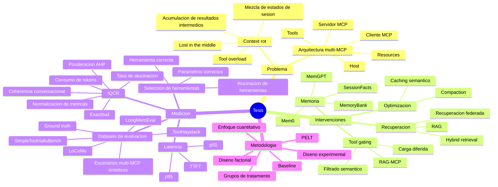

# Arbol de la tesis

> Mapa inicial de navegacion de la investigacion sobre tecnicas de memoria y gestion de contexto para reducir el [[Context rot]] en [[Agente LLM|agentes LLM]] conectados a multiples [[Servidor MCP|servidores MCP]].

## Tesis central

La tesis busca medir empiricamente si tecnicas como [[Tool gating]], [[SessionFacts]], [[MemoryBank]], [[Caching semantico]] y [[Recuperacion federada]] reducen la degradacion de respuestas en agentes LLM multi-MCP, evaluando calidad, costo y latencia bajo condiciones experimentales controladas.

## Arbol conceptual

## Columna vertebral — capítulos de la tesis

| Capítulo | Contenido |
|---|---|
| [[Cap 1 - Aspectos de la Problematica]] | Realidad problemática · Formulación · Justificación · Objetivos · Delimitación |
| [[Cap 2 - Marco Teorico]] | Antecedentes · Bases teóricas · Glosario · Marco referencial · Hipótesis · Variables |
| [[Cap 3 - Marco Metodologico]] | Enfoque · Diseño · Nivel · Tipo · Sujetos · Métodos · Instrumentos · Ética |
| [[Cap 4 - Aspectos Administrativos]] | Recursos · Presupuesto · Cronograma |
| [[Cap 5 - Referencias]] | Fichas individuales de todas las fuentes |
| [[Cap 6 - Anexos]] | Matrices de consistencia · Documentos fuente |

## Páginas formales de la tesis

- [[Resumen de la tesis]]
- [[Problema de investigacion]]
- [[Objetivos de investigacion]]
- [[Hipotesis de investigacion]]
- [[Variables e indicadores]]
- [[Diseno metodologico]]
- [[Matriz de consistencia]]

## Conceptos nucleares

- [[Agente LLM]]
- [[Model Context Protocol]]
- [[Servidor MCP]]
- [[Context rot]]
- [[Tool overload]]
- [[Tool gating]]
- [[SessionFacts]]
- [[MemoryBank]]
- [[Caching semantico]]
- [[Recuperacion federada]]
- [[IQCR]]
- [[Dataset de evaluacion]]
- [[Ground truth]]
- [[Exactitud de respuesta]]
- [[Tasa de alucinacion]]
- [[Coherencia conversacional]]
- [[Eficiencia de tokens]]
- [[LongMemEval]]
- [[LoCoMo]]
- [[SimpleToolHalluBench]]
- [[ToolHaystack]]
- [[Escenarios multi-MCP sinteticos]]

## Preguntas guia

- Que se degrada cuando aumenta el contexto activo?
- Que mecanismos explican la degradacion en arquitecturas multi-MCP?
- Que tecnicas reducen el problema con menor costo adicional?
- En que punto aparecen umbrales estadisticamente detectables?
- Que configuracion ofrece mejor relacion calidad-costo-latencia?

## Fuentes base

- [[Catalogo inicial de fuentes]]
- Documentos originales en `investigacion/`.
