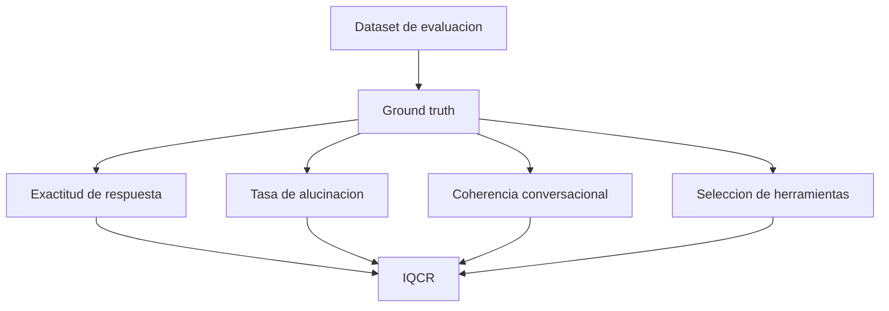

# Ground truth

## Definicion

Conjunto de respuestas, hechos, etiquetas o salidas esperadas que se consideran correctas y sirven como referencia para evaluar el desempeno del agente.

En terminos simples, el ground truth es la "verdad de referencia" contra la cual se compara lo que responde o hace un [[Agente LLM]].

## Diferencia entre dataset y ground truth

Un [[Dataset de evaluacion]] es el paquete completo de datos usado para probar el sistema. Puede incluir conversaciones, preguntas, herramientas disponibles, documentos, metadatos y respuestas esperadas.

El ground truth es la parte de ese dataset que indica que deberia considerarse correcto.

```text
Dataset = material completo de evaluacion
Ground truth = respuesta, etiqueta o salida correcta dentro de ese material
```

Por eso, en la tesis no conviene decir que "el ground truth es el dataset" sin matiz. Es mejor decir que los datasets contienen, proporcionan o permiten construir el ground truth.

## Ejemplo simple

```text
Dataset:
- Conversacion de 50 turnos
- Pregunta en el turno 51:
  "Cual fue la fecha que mencione para la reunion?"
- Historial relevante:
  "La reunion sera el 15 de mayo."
- Respuesta esperada:
  "15 de mayo"
```

En este ejemplo:

- El dataset contiene la conversacion, la pregunta y la respuesta esperada.
- El ground truth es `"15 de mayo"`.
- Si el agente responde `"15 de mayo"`, la [[Exactitud de respuesta]] es alta.
- Si responde `"18 de mayo"` o inventa una fecha, aumenta la [[Tasa de alucinacion]].

## Definicion recomendada para la tesis

El ground truth es el conjunto de respuestas esperadas, etiquetas correctas, herramientas esperadas, parametros validos y hechos verificables utilizados como referencia para medir exactitud, alucinacion, coherencia y seleccion correcta de herramientas.

## Uso en la tesis

El ground truth permite calcular o validar:

- [[Exactitud de respuesta]]
- [[Tasa de alucinacion]]
- [[Coherencia conversacional]]
- seleccion correcta de herramientas
- parametros correctos de herramientas
- actualizacion correcta de memoria
- ausencia de informacion cuando la respuesta correcta es "no se sabe" o "no esta en el contexto"

## Tipos de ground truth en esta investigacion

| Dimension evaluada | Ground truth necesario |
|---|---|
| Exactitud de respuesta | Respuesta esperada o facts correctos |
| Tasa de alucinacion | Hechos verificables correctos e incorrectos |
| Coherencia conversacional | Estado conversacional esperado o ausencia de contradiccion |
| Seleccion de herramienta | Tool correcta para una tarea |
| Parametros de herramienta | Argumentos validos esperados |
| Memoria longitudinal | Hechos pasados que deben recordarse |
| Ausencia de informacion | Confirmacion de que no existe dato suficiente para responder |

## Fuentes posibles

- Respuestas anotadas de benchmarks.
- Outputs esperados de herramientas.
- Escenarios sinteticos con respuesta conocida.
- Validacion manual de respuestas de referencia.

## Datasets que pueden aportar ground truth

En la tesis se mencionan varios datasets o benchmarks que pueden aportar distintos tipos de ground truth:

- [[LongMemEval]]: respuestas esperadas para evaluar memoria conversacional a largo plazo.
- [[LoCoMo]]: referencias para coherencia, consistencia y memoria multi-sesion.
- [[SimpleToolHalluBench]]: etiquetas sobre tools existentes, tools ausentes, parametros validos y alucinaciones de herramientas.
- [[ToolHaystack]]: herramienta correcta dentro de catalogos grandes con distractores.
- [[Escenarios multi-MCP sinteticos]]: casos creados para la tesis con respuesta, servidor, tool y parametros esperados.

## Relacion con IQCR

El [[IQCR]] depende del ground truth porque sus componentes requieren una referencia de comparacion. Sin ground truth, la evaluacion puede volverse subjetiva o depender demasiado de jueces automaticos.



## Riesgo metodologico

Si el ground truth esta incompleto o ambiguo, una respuesta correcta podria ser penalizada injustamente, o una respuesta incorrecta podria parecer valida.

Riesgos frecuentes:

- Respuestas esperadas demasiado rigidas.
- Varias respuestas correctas pero solo una anotada.
- Preguntas ambiguas.
- Ground truth desactualizado.
- Herramientas con resultados no deterministas.
- Evaluacion automatica que confunde parafrasis con error.

Por eso conviene documentar criterios de anotacion, ejemplos positivos y negativos, y procedimientos para resolver ambiguedades.

## Conceptos relacionados

- [[IQCR]]
- [[Dataset de evaluacion]]
- [[Exactitud de respuesta]]
- [[Tasa de alucinacion]]
- [[Coherencia conversacional]]
- [[LongMemEval]]
- [[LoCoMo]]
- [[SimpleToolHalluBench]]
- [[ToolHaystack]]
- [[Escenarios multi-MCP sinteticos]]
