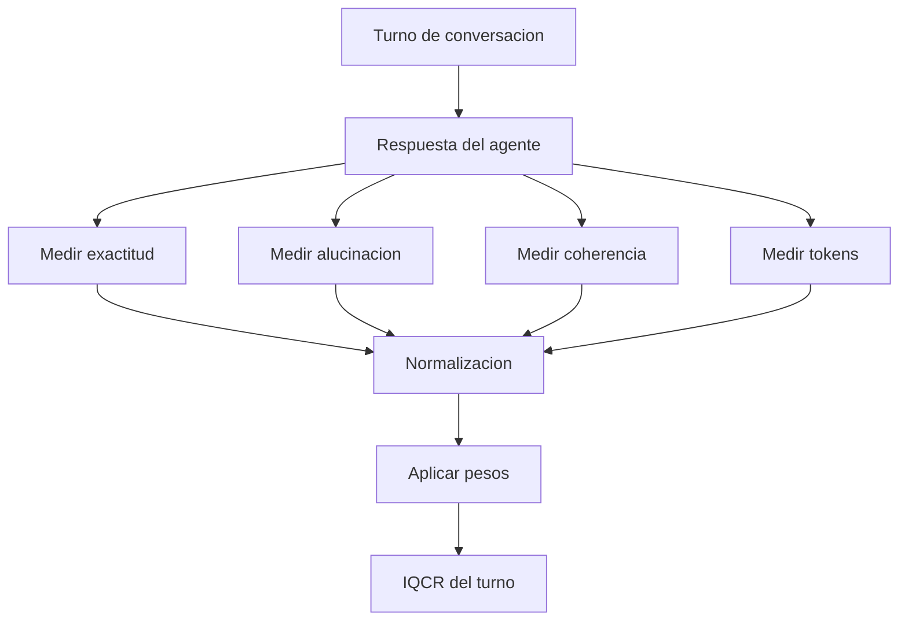

# IQCR

## Nombre

Indice de Calidad de Respuesta Compuesto.

## Definicion

El IQCR es una metrica agregada propuesta para medir, en un solo valor numerico, la calidad global de respuesta de un [[Agente LLM]] durante los experimentos de la tesis.

Su funcion es convertir varias dimensiones del [[Context rot]] en una escala comun. En vez de mirar por separado exactitud, alucinacion, coherencia y consumo de tokens, el IQCR permite comparar configuraciones completas del agente: baseline, tecnicas individuales y combinaciones de tecnicas.

## Para que sirve

El IQCR sirve para responder preguntas como:

- Que configuracion del agente responde mejor despues de muchas interacciones?
- Que tecnica reduce mas el [[Context rot]] sin aumentar demasiado el costo?
- En que turno comienza a caer la calidad de respuesta?
- Que combinacion de tecnicas ofrece mejor relacion calidad-costo?
- Cual es el punto de comparacion entre baseline y tratamientos?

En la tesis funciona como la variable dependiente principal. Si una tecnica mejora el IQCR frente al baseline, se interpreta como evidencia de que esa tecnica reduce la degradacion de respuestas.

## Componentes

El IQCR integra cuatro dimensiones primarias:

- [[Exactitud de respuesta]]: mide si la respuesta coincide con el ground truth.
- [[Tasa de alucinacion]]: mide la proporcion de afirmaciones incorrectas o no fundamentadas.
- [[Coherencia conversacional]]: mide si la respuesta mantiene consistencia con la conversacion previa.
- [[Eficiencia de tokens]]: mide cuanto costo de tokens requiere el agente para producir una respuesta util.

La tasa de alucinacion se usa en forma invertida, porque menos alucinacion significa mayor calidad. Por eso se incorpora como complemento:

```text
calidad_por_no_alucinacion = 1 - tasa_de_alucinacion_normalizada
```

## Formula conceptual

Una formulacion inicial puede expresarse asi:

```text
IQCR = w1 * Exactitud
     + w2 * NoAlucinacion
     + w3 * Coherencia
     + w4 * EficienciaTokens
```

Donde:

- `w1`, `w2`, `w3` y `w4` son pesos.
- La suma de los pesos debe ser igual a 1.
- Cada componente debe estar normalizado en el rango `[0, 1]`.
- Un valor cercano a 1 representa mejor calidad.
- Un valor cercano a 0 representa peor calidad.

## Ejemplo simple

Si una respuesta tiene:

- Exactitud: 0.85
- Tasa de alucinacion: 0.10
- Coherencia: 0.80
- Eficiencia de tokens: 0.70

Entonces:

```text
NoAlucinacion = 1 - 0.10 = 0.90
```

Con pesos iguales:

```text
IQCR = 0.25*0.85 + 0.25*0.90 + 0.25*0.80 + 0.25*0.70
IQCR = 0.8125
```

Esto indicaria una calidad global alta, aunque no perfecta, afectada principalmente por la eficiencia de tokens.

## Como se aplica en el experimento

El IQCR se calcula por turno de conversacion. Cada turno genera una respuesta del agente y, sobre esa respuesta, se miden los componentes del indice.



Luego se puede agregar por sesion, por grupo experimental o por condicion:

- IQCR por turno.
- IQCR promedio por conversacion.
- IQCR en turnos criticos: 10, 30, 50 y 100.
- Caida porcentual del IQCR frente al turno inicial.
- Diferencia de IQCR entre baseline y tecnica aplicada.

## Interpretacion

| Rango orientativo | Interpretacion |
|---|---|
| 0.80 - 1.00 | Calidad alta; el agente conserva precision y eficiencia. |
| 0.60 - 0.79 | Calidad aceptable; hay degradacion moderada o costo elevado. |
| 0.40 - 0.59 | Calidad debil; el context rot ya afecta el desempeno. |
| 0.00 - 0.39 | Calidad critica; la respuesta es poco confiable o muy costosa. |

Estos rangos son orientativos. La tesis debe validar los umbrales finales con los datos experimentales.

## Relacion con context rot

El [[Context rot]] puede verse como una caida progresiva del IQCR a lo largo del tiempo.

```text
tasa_de_degradacion = (IQCR_turno_inicial - IQCR_turno_final) / IQCR_turno_inicial
```

Por ejemplo, si el IQCR cae de 0.82 en el turno 10 a 0.58 en el turno 50:

```text
degradacion = (0.82 - 0.58) / 0.82 = 0.2927
```

Eso equivale a una degradacion aproximada de 29.27%.

## Uso para comparar tecnicas

El IQCR permite comparar:

- Baseline vs. [[SessionFacts]]
- Baseline vs. [[Tool gating]]
- Baseline vs. [[MemoryBank]]
- Baseline vs. [[Caching semantico]]
- Tecnicas individuales vs. combinaciones

La comparacion no debe mirar solo el valor absoluto del IQCR, sino tambien:

- mejora porcentual frente al baseline;
- estabilidad del IQCR a lo largo de la conversacion;
- latencia agregada por la tecnica;
- costo de tokens adicional o reducido;
- significancia estadistica de la diferencia observada.

## Ponderacion

La ponderacion define cuanto importa cada componente. No todas las dimensiones tienen necesariamente el mismo peso.

Una configuracion inicial conservadora podria ser:

| Componente | Peso inicial sugerido |
|---|---:|
| [[Exactitud de respuesta]] | 0.35 |
| Complemento de [[Tasa de alucinacion]] | 0.30 |
| [[Coherencia conversacional]] | 0.20 |
| [[Eficiencia de tokens]] | 0.15 |

Esta distribucion prioriza calidad y confiabilidad sobre costo. Tiene sentido para una primera version porque una respuesta barata pero incorrecta no deberia recibir buen puntaje.

La tesis puede ajustar estos pesos mediante [[AHP]] si se consulta a expertos o si se decide formalizar la importancia relativa de cada dimension.

## Normalizacion

Antes de combinar componentes, todos deben estar en la misma escala `[0, 1]`.

- Exactitud ya suele estar en `[0, 1]`.
- Tasa de alucinacion se invierte como `1 - alucinacion`.
- Coherencia puede normalizarse desde BERTScore u otra metrica semantica.
- Tokens deben transformarse para que menor consumo signifique mayor puntaje.

La normalizacion evita comparar magnitudes incompatibles. Sin ella, una metrica con numeros grandes, como tokens, podria dominar artificialmente el indice.

Ver: [[Normalizacion de metricas]].

## Precauciones

El IQCR no reemplaza el analisis individual de sus componentes. Es util para comparacion global, pero siempre debe acompanarse de sus submetricas.

Casos problematicos:

- Una tecnica podria mejorar tokens pero empeorar exactitud.
- Una tecnica podria mejorar coherencia pero aumentar latencia.
- Un promedio alto podria esconder fallas criticas en algunos turnos.
- Pesos mal definidos pueden sesgar la conclusion.

Por eso el IQCR debe reportarse junto con tablas de componentes, intervalos de confianza y pruebas estadisticas.

## Preguntas pendientes

- Que ponderacion final tendra cada componente?
- Se usara [[AHP]] con expertos para definir los pesos?
- Que funcion exacta se usara para transformar tokens en eficiencia?
- La latencia entrara dentro del IQCR o se reportara como metrica externa?
- El IQCR se calculara por turno, por bloque de turnos o por sesion completa en el analisis final?

## Conceptos relacionados

- [[Context rot]]
- [[Exactitud de respuesta]]
- [[Tasa de alucinacion]]
- [[Coherencia conversacional]]
- [[Eficiencia de tokens]]
- [[Normalizacion de metricas]]
- [[AHP]]
- [[Baseline]]
- [[Variable dependiente]]
